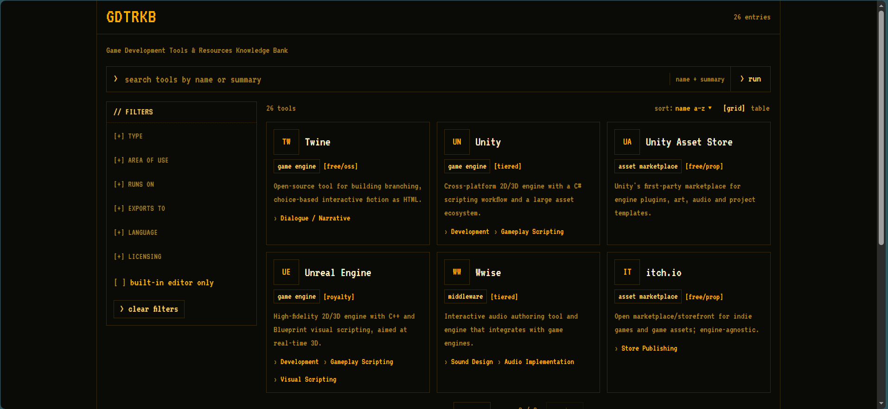
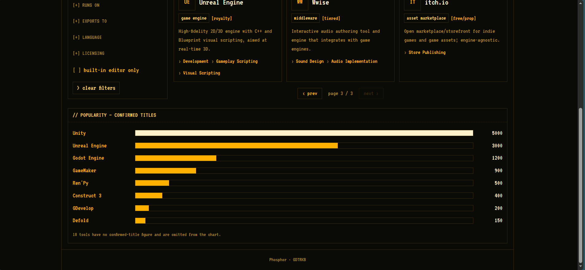
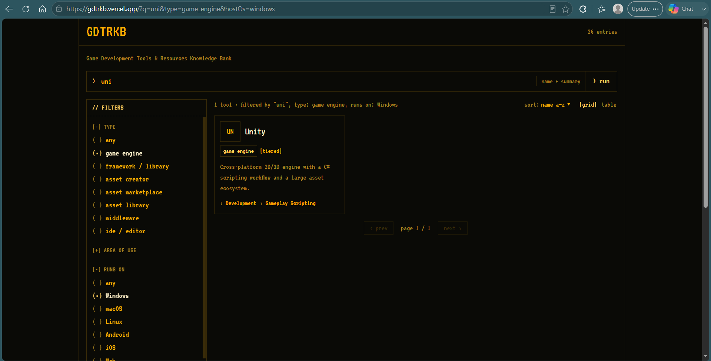
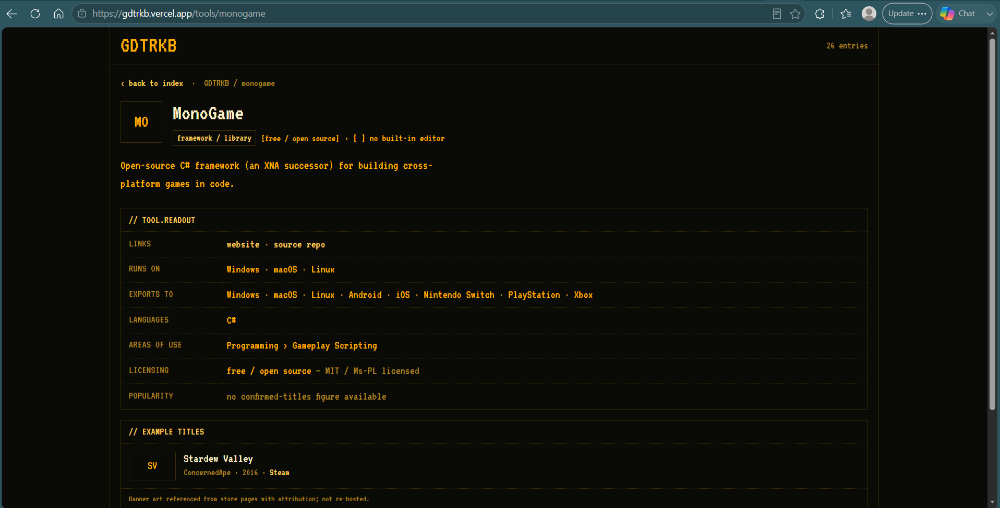
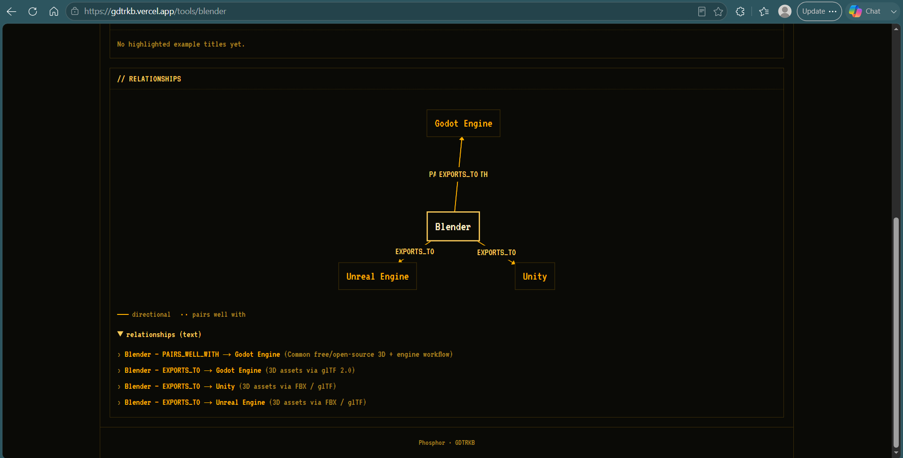
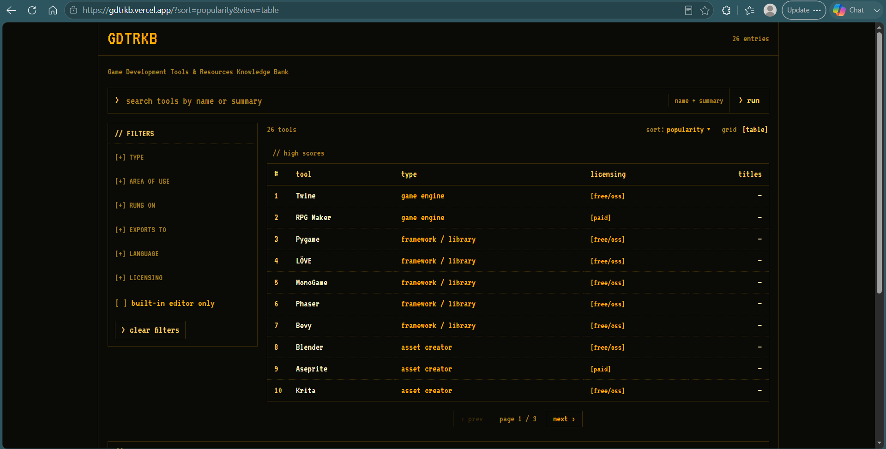
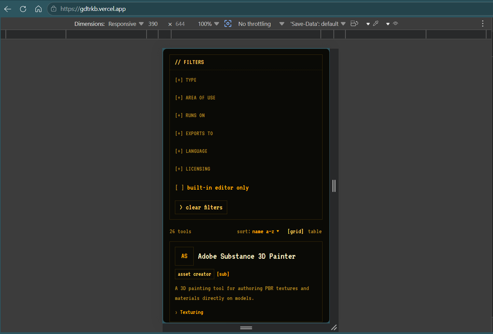

# GDTRKB

**Game Development Tools & Resources Knowledge Bank**

[](https://github.com/CipDan/gdtrkb/actions/workflows/ci.yml)

GDTRKB — a read-only, curator-populated catalog of game development tools (engines, frameworks, asset creators, middleware) modeled as an ontology. Search, filter, and browse; each tool's detail page shows its relationship graph and popularity.

**Live:** https://gdtrkb.vercel.app/
**Status:** `v1.0.0-beta.1` — feature-complete MVP; catalog data still has placeholder values, see [Known limitations](#known-limitations).

## About this project

GDTRKB is a practical exercise in **"vibe coding"** — building a real, non-trivial application end-to-end with AI assistance rather than writing every line by hand. The app, its specs, and its documentation were built with the assistance of **[Claude Code](https://claude.com/claude-code)**.

## Screenshots

**Search — default state**


**Popularity chart**


**Search — filtered**


**Tool detail page**


**Relationship graph**


**High-score table view**


**Mobile**


## Features

- **Search & filter** — text search over name + summary, faceted filtering (type, area of use, host OS, target platform, language, licensing, built-in editor)
- **Card grid & high-score table** — two results views, toggleable, with all search/filter/sort state kept in the URL (shareable, bookmarkable)
- **Tool detail pages** — full schema view: links, areas of use, platforms, languages, example games, popularity figure
- **Relationship graph** — a per-tool 1-hop neighborhood graph (`ToolGraph`) with a text-list fallback for accessibility
- **Popularity chart** — confirmed-commercial-titles ranking

## Tech stack

| Layer | Choice |
|---|---|
| Frontend | Next.js (App Router), TypeScript, Tailwind — "Phosphor" design tokens |
| API | PostGraphile (Core, queries-only) + `postgraphile-plugin-connection-filter` |
| Database | PostgreSQL |
| Graph rendering | React Flow (`@xyflow/react`) |
| Testing | Vitest |
| Hosting | Vercel (frontend) + Railway (always-on API) + Neon (Postgres) |

All GraphQL access is server-side (BFF pattern) — the browser never talks to PostGraphile directly.

## Getting started

### Prerequisites
- Node.js 22+
- A PostgreSQL database (e.g. a free [Neon](https://neon.tech) project)
- The PostgreSQL client (`psql`), used by the schema/seed step below

### 1. Clone & install
```bash
git clone https://github.com/CipDan/gdtrkb.git
cd gdtrkb
npm install
```

### 2. Load the schema + seed data
```bash
psql "$DATABASE_URL" -f db/01_schema.sql
psql "$DATABASE_URL" -f db/02_seed.sql
```

### 3. Run the API (PostGraphile)
```bash
cd db/postgraphile
npm install
DATABASE_URL="postgres://..." PORT=5000 ENABLE_GRAPHIQL=true node server.js
```

### 4. Configure and run the frontend
Step 3 keeps running in its terminal, so do this from a new terminal, back at the repo root. Copy `.env.example` to `.env.local` and set `POSTGRAPHILE_URL` to the address from step 3 (e.g. `http://localhost:5000/graphql`):
```bash
cp .env.example .env.local
npm run dev
```
Visit `http://localhost:3000`.

### Scripts

| Command | Purpose |
|---|---|
| `npm run dev` | Local dev server |
| `npm run build` / `npm run start` | Production build / serve |
| `npm run lint` | ESLint |
| `npm run typecheck` | `tsc --noEmit` |
| `npm run test` | Vitest |

## Documentation

Full specs live in [`docs/`](docs/):
- [`app-spec.md`](docs/app-spec.md) — feature scope, routes, per-component behavior
- [`architecture.md`](docs/architecture.md) — folder structure, module map
- [`schema-spec.md`](docs/schema-spec.md) — database schema + GraphQL API contract
- [`deployment.md`](docs/deployment.md) / [`ci-deploy-setup.md`](docs/ci-deploy-setup.md) — hosting and CI/CD
- [`design/design-tokens-3-phosphor.md`](docs/design/design-tokens-3-phosphor.md) — UI design tokens

## Known limitations

The app and schema are feature-complete against the MVP spec, but the seeded catalog data is a mix of verified and placeholder values:
- Popularity figures (confirmed commercial-titles counts) are **mocked** for a portion of tools
- Some tool logos and example-game banner images are **missing or placeholder**

## Scope

Read-only, public, curator-populated catalog — no accounts, no write/submission path, no admin UI. Data is maintained via SQL seed by the curator.
