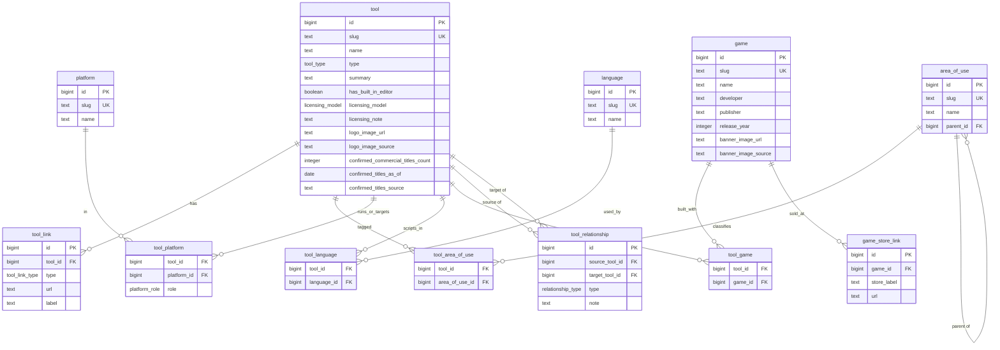

# Game Development Tools Knowledge Bank — Schema & API Specification

> **Purpose of this document.** This is an implementation spec for a **read-only, curator-populated knowledge bank of game development tools**, served as an **ontology-style GraphQL API** over a relational database. It is written to be handed to an implementing model or developer. It defines the data model, the full relational schema, the GraphQL API surface, and implementation guidance.

---

## 1. Overview & goals

The knowledge bank catalogs game development tools (engines, frameworks, asset creators, marketplaces, middleware, etc.) and the relationships between them. It is:

- **Read-only to the public API.** Only the curator populates data (via SQL/admin seeding). The GraphQL endpoint exposes **queries only** — no public mutations.
- **Ontology-shaped.** Tools are nodes; they connect to each other through **typed, directional relationship edges** and share taxonomies (areas of use, platforms, languages, games). This supports graph traversal and visual/graph presentation.
- **Query-first.** The value is in filtering and traversing: "engines that export to Switch," "everything under asset creation," "what pairs well with Godot," "tools ordered by popularity."

### Recommended stack

| Layer | Choice | Why |
|---|---|---|
| Database | **PostgreSQL** | Handles the bounded, shallow graph cleanly via join/edge tables; JSONB available; excellent tooling. The graph is bounded and shallow, so a dedicated graph DB is unnecessary — the "ontology" lives in the API layer. |
| API | **GraphQL, auto-generated via [PostGraphile](https://www.graphile.org/postgraphile/)** | Generates the full GraphQL schema (types, queries, filtering, pagination, relationship traversal in both directions) straight from the Postgres schema and foreign keys. Minimal API code. Ideal for a read-only catalog. |
| Filtering | `postgraphile-plugin-connection-filter` | Enables rich filtering across fields and relations (e.g. filter tools by related platform/area/language). |

Run PostGraphile with default mutations disabled so the public surface is queries-only.

**PostGraphile edition — Core (free, open-source) is sufficient for this entire spec.** Every operation used here — schema generation from tables/FKs, exposing views via smart comments, the `connection-filter` plugin (free/MIT), `orderBy`, connection pagination, and both directions of the relationship edges — is a Core (V4, MIT) feature. The commercial **Pro** plugin only adds production-hardening for *public, untrusted* traffic (read-replica scaling and protection against expensive queries); it is **not** required for a read-only, curator-populated catalog. (V5 is also MIT-licensed if you prefer to start there.)

---

## 2. Ontology / data model

**Central entity:** `Tool`.

**Taxonomy / reference entities** (many-to-many with Tool unless noted):
- `AreaOfUse` — extensible, **shallow hierarchical** taxonomy (self-referencing `parent`).
- `Platform` — a single table of platforms; the *role* (host-OS vs target/export) lives on the join, so "Windows" can be both.
- `Language` — the scripting/authoring languages a developer writes game logic in (e.g. GDScript, C#), **not** the tool's implementation language.
- `Game` — a **shared, reusable** entity (one game can link to several tools).

**Relationship edge (tool ↔ tool):** a single unified `ToolRelationship` edge table with a typed `relationship_type`. This replaces having a separate "integration" and "synergy" concept:
- **Directional / mechanical:** `EXPORTS_TO`, `IMPORTS_FROM`, `PLUGIN_FOR`, `EMBEDS`, `BUILDS_ON`.
- **Undirected / editorial:** `PAIRS_WELL_WITH` (the former "synergy" — a curated pairing that may have no technical link, e.g. Aseprite + Godot).
- Every edge carries an optional free-text `note`.

```
                 ┌──────────────┐
   host_os / ─── │   Platform   │
   target        └──────────────┘
        │
        │        ┌──────────────┐        ┌───────────────┐
        └────────│     Tool     │────────│   AreaOfUse   │ (self-ref parent)
                 └──────┬───────┘  m:n    └───────────────┘
      m:n ┌─────────────┼───────────────┐
          │             │               │
   ┌────────────┐  ┌──────────┐   ┌──────────────────┐
   │  Language  │  │   Game   │   │ ToolRelationship │  (Tool → Tool, typed)
   └────────────┘  └──────────┘   └──────────────────┘
```

### 2.1 Entity-relationship diagram

The concrete relational structure (tables, keys, and cardinalities). Join tables carry the many-to-many links; `tool_platform` carries the host-vs-target `role`; `tool_relationship` is the self-referencing typed edge.



> The `tool_relationship_bidirectional` view (§4.7) is derived from `tool_relationship` and is omitted here since it holds no data of its own.

---

## 3. Enumerated types

```sql
-- Single core "type" of a tool (its identifier alongside its name)
CREATE TYPE tool_type AS ENUM (
  'game_engine',
  'framework_library',
  'asset_creator',
  'asset_marketplace',
  'asset_library',
  'middleware',        -- e.g. FMOD, Havok: plug into other tools
  'ide_editor'
);

CREATE TYPE licensing_model AS ENUM (
  'free_open_source',
  'free_proprietary',  -- free to use but closed-source (e.g. itch.io, some free tiers)
  'paid_one_time',
  'subscription',
  'royalty_based',
  'tiered'
);

-- Unified tool-to-tool edge types
CREATE TYPE relationship_type AS ENUM (
  'EXPORTS_TO',       -- directional
  'IMPORTS_FROM',     -- directional
  'PLUGIN_FOR',       -- directional
  'EMBEDS',           -- directional
  'BUILDS_ON',        -- directional
  'PAIRS_WELL_WITH'   -- undirected / editorial (was "synergy")
);

-- Role a platform plays for a given tool
CREATE TYPE platform_role AS ENUM (
  'HOST_OS',          -- the tool runs on this OS
  'TARGET'            -- you can ship/export games to this platform
);

-- Structured link types per tool
CREATE TYPE tool_link_type AS ENUM (
  'WEBSITE',
  'DOCS',
  'SOURCE_REPO',
  'COMMUNITY'
);
```

---

## 4. Relational schema

All tables use a surrogate `id` plus a human-readable, unique `slug` (stable identifier for lookups and URLs).

### 4.1 Core: `tool`

```sql
CREATE TABLE tool (
  id                                bigint GENERATED ALWAYS AS IDENTITY PRIMARY KEY,
  slug                              text NOT NULL UNIQUE,
  name                              text NOT NULL,
  type                              tool_type NOT NULL,      -- single core use
  summary                           text NOT NULL,           -- short summary
  has_built_in_editor               boolean NOT NULL DEFAULT false,

  licensing_model                   licensing_model NOT NULL,
  licensing_note                    text,                    -- optional detail

  logo_image_url                    text,                    -- reference/URL, curator-cleared
  logo_image_source                 text,                    -- attribution / source note

  -- Popularity metric (manually-entered aggregate; NOT the count of linked example games)
  confirmed_commercial_titles_count integer,
  confirmed_titles_as_of            date,                    -- when the figure was true
  confirmed_titles_source           text,                    -- where the figure came from

  created_at                        timestamptz NOT NULL DEFAULT now(),
  updated_at                        timestamptz NOT NULL DEFAULT now()
);

CREATE INDEX idx_tool_type            ON tool (type);
CREATE INDEX idx_tool_licensing       ON tool (licensing_model);
CREATE INDEX idx_tool_popularity      ON tool (confirmed_commercial_titles_count DESC NULLS LAST);
```

> **On images.** `*_image_url` stores a **reference** (link to official store page, press-kit asset, or Wikimedia), never a hosted copy of copyrighted material. `*_image_source` records where it came from and under what terms. Game store art and tool logos are rarely public domain, so treat these as *curator-cleared references with attribution* rather than public-domain assets.

### 4.2 Structured links: `tool_link`

Multiple links per tool, queryable by type.

```sql
CREATE TABLE tool_link (
  id        bigint GENERATED ALWAYS AS IDENTITY PRIMARY KEY,
  tool_id   bigint NOT NULL REFERENCES tool(id) ON DELETE CASCADE,
  type      tool_link_type NOT NULL,
  url       text NOT NULL,
  label     text,                      -- optional display label
  UNIQUE (tool_id, type, url)
);
CREATE INDEX idx_tool_link_tool ON tool_link (tool_id);
CREATE INDEX idx_tool_link_type ON tool_link (type);
```

### 4.3 Areas of use (hierarchical taxonomy): `area_of_use`

Extensible; shallow hierarchy via self-referencing `parent_id` (recommend max 2 levels).

```sql
CREATE TABLE area_of_use (
  id        bigint GENERATED ALWAYS AS IDENTITY PRIMARY KEY,
  slug      text NOT NULL UNIQUE,
  name      text NOT NULL,
  parent_id bigint REFERENCES area_of_use(id) ON DELETE SET NULL
);
CREATE INDEX idx_area_parent ON area_of_use (parent_id);

CREATE TABLE tool_area_of_use (
  tool_id        bigint NOT NULL REFERENCES tool(id) ON DELETE CASCADE,
  area_of_use_id bigint NOT NULL REFERENCES area_of_use(id) ON DELETE CASCADE,
  PRIMARY KEY (tool_id, area_of_use_id)
);
```

#### Seed taxonomy (tightened)

The taxonomy is deliberately a **curated, shallow (2-level) tree**: a small set of stable **top-level domains** (the phase or discipline of the pipeline), each with a focused set of **leaf areas** (the specific job a tool does). Design rules that keep it clean:

1. **Two levels only.** A parent is a broad domain; a leaf is a concrete task. Nothing nests deeper.
2. **Tag tools with the most specific leaf that applies** (e.g. Blender → `3d_modelling`, not the parent `asset_creation`). Rollup queries recover the parent, so tagging leaves loses nothing.
3. **Parents are query buckets, not tags.** You *can* tag a tool with a top-level domain that has no natural leaf (e.g. a general engine → `development`), but avoid tagging both a parent and its own child on the same tool.
4. **Extend by adding leaves under an existing domain first;** add a new top-level domain only when a tool genuinely fits none.

| Top-level domain (parent) | Leaf areas (children) |
|---|---|
| `asset_creation` | `3d_modelling`, `2d_art`, `pixel_art`, `texturing`, `sculpting`, `rigging`, `animation`, `vfx` |
| `audio` | `sound_design`, `music_composition`, `audio_implementation` |
| `world_building` | `level_design`, `terrain`, `tilemap`, `world_streaming` |
| `programming` | `gameplay_scripting`, `visual_scripting`, `shader_authoring`, `ai_behaviour`, `physics` |
| `networking` | `netcode`, `backend_services`, `matchmaking` |
| `production` | `version_control`, `project_management`, `build_ci`, `localization`, `analytics`, `qa_testing` |
| `ui_ux` | `ui_authoring`, `dialogue_narrative`, `accessibility` |
| `distribution` | `store_publishing`, `packaging`, `live_ops` |
| `development` | *(top-level; general-purpose engines/frameworks that span the whole pipeline)* |

Concrete `INSERT`s for this taxonomy are in **§4.8 Sample seed data**.

### 4.4 Platforms (host OS + target/export): `platform`

One table; the join carries the role, so a platform like "Windows" can be both a host OS and a target.

```sql
CREATE TABLE platform (
  id   bigint GENERATED ALWAYS AS IDENTITY PRIMARY KEY,
  slug text NOT NULL UNIQUE,
  name text NOT NULL
);

CREATE TABLE tool_platform (
  tool_id     bigint NOT NULL REFERENCES tool(id) ON DELETE CASCADE,
  platform_id bigint NOT NULL REFERENCES platform(id) ON DELETE CASCADE,
  role        platform_role NOT NULL,
  PRIMARY KEY (tool_id, platform_id, role)
);
CREATE INDEX idx_tool_platform_platform ON tool_platform (platform_id, role);
```

### 4.5 Languages (scripting/authoring): `language`

```sql
CREATE TABLE language (
  id   bigint GENERATED ALWAYS AS IDENTITY PRIMARY KEY,
  slug text NOT NULL UNIQUE,
  name text NOT NULL
);

CREATE TABLE tool_language (
  tool_id     bigint NOT NULL REFERENCES tool(id) ON DELETE CASCADE,
  language_id bigint NOT NULL REFERENCES language(id) ON DELETE CASCADE,
  PRIMARY KEY (tool_id, language_id)
);
```

### 4.6 Games (shared, reusable): `game`

```sql
CREATE TABLE game (
  id                  bigint GENERATED ALWAYS AS IDENTITY PRIMARY KEY,
  slug                text NOT NULL UNIQUE,
  name                text NOT NULL,
  developer           text,
  publisher           text,
  release_year        integer,
  banner_image_url    text,   -- reference/URL, curator-cleared
  banner_image_source text,   -- attribution / source note
  created_at          timestamptz NOT NULL DEFAULT now(),
  updated_at          timestamptz NOT NULL DEFAULT now()
);

-- Structured store links for a game
CREATE TABLE game_store_link (
  id          bigint GENERATED ALWAYS AS IDENTITY PRIMARY KEY,
  game_id     bigint NOT NULL REFERENCES game(id) ON DELETE CASCADE,
  store_label text NOT NULL,           -- e.g. 'Steam', 'GOG', 'itch.io'
  url         text NOT NULL,
  UNIQUE (game_id, url)
);

-- The 2–3 highlighted example titles per tool (many-to-many; a game may link to several tools)
CREATE TABLE tool_game (
  tool_id bigint NOT NULL REFERENCES tool(id) ON DELETE CASCADE,
  game_id bigint NOT NULL REFERENCES game(id) ON DELETE CASCADE,
  PRIMARY KEY (tool_id, game_id)
);
```

> **Note.** `tool_game` links only the small set of *highlighted example* titles. This is deliberately separate from `tool.confirmed_commercial_titles_count`, which is a much larger manually-maintained aggregate used for popularity charting.

### 4.7 Unified tool-to-tool edges: `tool_relationship`

```sql
CREATE TABLE tool_relationship (
  id             bigint GENERATED ALWAYS AS IDENTITY PRIMARY KEY,
  source_tool_id bigint NOT NULL REFERENCES tool(id) ON DELETE CASCADE,
  target_tool_id bigint NOT NULL REFERENCES tool(id) ON DELETE CASCADE,
  type           relationship_type NOT NULL,
  note           text,
  CHECK (source_tool_id <> target_tool_id),
  UNIQUE (source_tool_id, target_tool_id, type)
);
CREATE INDEX idx_rel_source ON tool_relationship (source_tool_id);
CREATE INDEX idx_rel_target ON tool_relationship (target_tool_id);
CREATE INDEX idx_rel_type   ON tool_relationship (type);
```

**Directionality.** For directional types, store one row `source → target`. Both directions are queryable automatically (see §5). For the undirected `PAIRS_WELL_WITH`, store a single canonical row; it is exposed as bidirectional through the GraphQL-exposed view below.

**Bidirectional view (exposed through GraphQL).** This view presents every edge, and additionally mirrors each `PAIRS_WELL_WITH` row so a symmetric pairing appears as an edge from *either* node. It carries a synthetic unique key (`edge_id`) so PostGraphile Core can expose it as a queryable collection with node identity, and smart comments declare its foreign keys so `sourceTool`/`targetTool` resolve to the `Tool` type.

```sql
CREATE VIEW tool_relationship_bidirectional AS
  -- every edge as stored (mirrored = false)
  SELECT id AS relationship_id,
         id::text || ':f' AS edge_id,
         source_tool_id, target_tool_id, type, note,
         false AS mirrored
  FROM tool_relationship
UNION ALL
  -- symmetric pairings mirrored (mirrored = true)
  SELECT id AS relationship_id,
         id::text || ':r' AS edge_id,
         target_tool_id AS source_tool_id,
         source_tool_id AS target_tool_id,
         type, note,
         true AS mirrored
  FROM tool_relationship
  WHERE type = 'PAIRS_WELL_WITH';

-- Smart comments: give the view a primary key and FK relations so PostGraphile
-- (Core) exposes it with node identity and Tool relations.
COMMENT ON VIEW tool_relationship_bidirectional IS
  E'@primaryKey edge_id\n@foreignKey (source_tool_id) references tool (id)\n@foreignKey (target_tool_id) references tool (id)';
```

`edge_id` is unique across both halves (`:f` for the as-stored row, `:r` for the mirrored one), so every emitted edge is individually addressable. `relationship_id` still points back to the underlying `tool_relationship` row.

### 4.8 Sample seed data

Illustrative seed for three real tools (**Godot**, **Blender**, **FMOD**), a couple of real games, plus the full area-of-use taxonomy. It demonstrates: a shared `Game`, host-vs-target platform roles, scripting languages, structured links, a directional `EXPORTS_TO`/`PLUGIN_FOR` edge, and a symmetric `PAIRS_WELL_WITH` pairing. FK ids are resolved by `slug` subquery so the script is id-agnostic and re-runnable. **Insert order matters:** reference tables first, then tools, then join/edge rows, then games.

> `confirmed_commercial_titles_count` values below are **illustrative placeholders** — the curator supplies real figures with an `as_of` date.

```sql
-- 1) AREA OF USE (parents first, then leaves) -----------------------------
INSERT INTO area_of_use (slug, name) VALUES
  ('asset_creation','Asset Creation'), ('audio','Audio'),
  ('world_building','World Building'), ('programming','Programming'),
  ('networking','Networking'), ('production','Production'),
  ('ui_ux','UI / UX'), ('distribution','Distribution'),
  ('development','Development');

INSERT INTO area_of_use (slug, name, parent_id) VALUES
  ('3d_modelling','3D Modelling',        (SELECT id FROM area_of_use WHERE slug='asset_creation')),
  ('2d_art','2D Art',                    (SELECT id FROM area_of_use WHERE slug='asset_creation')),
  ('pixel_art','Pixel Art',              (SELECT id FROM area_of_use WHERE slug='asset_creation')),
  ('texturing','Texturing',              (SELECT id FROM area_of_use WHERE slug='asset_creation')),
  ('sculpting','Sculpting',              (SELECT id FROM area_of_use WHERE slug='asset_creation')),
  ('rigging','Rigging',                  (SELECT id FROM area_of_use WHERE slug='asset_creation')),
  ('animation','Animation',              (SELECT id FROM area_of_use WHERE slug='asset_creation')),
  ('vfx','VFX',                          (SELECT id FROM area_of_use WHERE slug='asset_creation')),
  ('sound_design','Sound Design',        (SELECT id FROM area_of_use WHERE slug='audio')),
  ('music_composition','Music Composition',(SELECT id FROM area_of_use WHERE slug='audio')),
  ('audio_implementation','Audio Implementation',(SELECT id FROM area_of_use WHERE slug='audio')),
  ('level_design','Level Design',        (SELECT id FROM area_of_use WHERE slug='world_building')),
  ('terrain','Terrain',                  (SELECT id FROM area_of_use WHERE slug='world_building')),
  ('tilemap','Tilemap',                  (SELECT id FROM area_of_use WHERE slug='world_building')),
  ('world_streaming','World Streaming',  (SELECT id FROM area_of_use WHERE slug='world_building')),
  ('gameplay_scripting','Gameplay Scripting',(SELECT id FROM area_of_use WHERE slug='programming')),
  ('visual_scripting','Visual Scripting',(SELECT id FROM area_of_use WHERE slug='programming')),
  ('shader_authoring','Shader Authoring',(SELECT id FROM area_of_use WHERE slug='programming')),
  ('ai_behaviour','AI Behaviour',        (SELECT id FROM area_of_use WHERE slug='programming')),
  ('physics','Physics',                  (SELECT id FROM area_of_use WHERE slug='programming')),
  ('netcode','Netcode',                  (SELECT id FROM area_of_use WHERE slug='networking')),
  ('backend_services','Backend Services',(SELECT id FROM area_of_use WHERE slug='networking')),
  ('matchmaking','Matchmaking',          (SELECT id FROM area_of_use WHERE slug='networking')),
  ('version_control','Version Control',  (SELECT id FROM area_of_use WHERE slug='production')),
  ('project_management','Project Management',(SELECT id FROM area_of_use WHERE slug='production')),
  ('build_ci','Build / CI',              (SELECT id FROM area_of_use WHERE slug='production')),
  ('localization','Localization',        (SELECT id FROM area_of_use WHERE slug='production')),
  ('analytics','Analytics',              (SELECT id FROM area_of_use WHERE slug='production')),
  ('qa_testing','QA / Testing',          (SELECT id FROM area_of_use WHERE slug='production')),
  ('ui_authoring','UI Authoring',        (SELECT id FROM area_of_use WHERE slug='ui_ux')),
  ('dialogue_narrative','Dialogue / Narrative',(SELECT id FROM area_of_use WHERE slug='ui_ux')),
  ('accessibility','Accessibility',      (SELECT id FROM area_of_use WHERE slug='ui_ux')),
  ('store_publishing','Store Publishing',(SELECT id FROM area_of_use WHERE slug='distribution')),
  ('packaging','Packaging',              (SELECT id FROM area_of_use WHERE slug='distribution')),
  ('live_ops','Live Ops',                (SELECT id FROM area_of_use WHERE slug='distribution'));

-- 2) PLATFORMS & LANGUAGES ------------------------------------------------
INSERT INTO platform (slug, name) VALUES
  ('windows','Windows'), ('macos','macOS'), ('linux','Linux'),
  ('android','Android'), ('ios','iOS'), ('web','Web'),
  ('nintendo-switch','Nintendo Switch');

INSERT INTO language (slug, name) VALUES
  ('gdscript','GDScript'), ('csharp','C#'), ('cpp','C++'), ('python','Python');

-- 3) TOOLS ----------------------------------------------------------------
INSERT INTO tool (slug, name, type, summary, has_built_in_editor,
                  licensing_model, licensing_note,
                  confirmed_commercial_titles_count, confirmed_titles_as_of, confirmed_titles_source)
VALUES
  ('godot','Godot Engine','game_engine',
   'Free, open-source 2D/3D game engine with its own editor and the GDScript language.',
   true,'free_open_source','MIT licensed',
   1200,'2026-01-01','illustrative placeholder'),
  ('blender','Blender','asset_creator',
   'Open-source 3D creation suite for modelling, sculpting, rigging, animation and rendering.',
   true,'free_open_source','GPL licensed',
   NULL,NULL,NULL),
  ('fmod','FMOD','middleware',
   'Adaptive audio engine and authoring tool (FMOD Studio) that plugs into game engines.',
   true,'tiered','Free tier for small budgets; paid tiers above revenue thresholds');

-- 4) STRUCTURED LINKS -----------------------------------------------------
INSERT INTO tool_link (tool_id, type, url) VALUES
  ((SELECT id FROM tool WHERE slug='godot'),'WEBSITE','https://godotengine.org'),
  ((SELECT id FROM tool WHERE slug='godot'),'DOCS','https://docs.godotengine.org'),
  ((SELECT id FROM tool WHERE slug='godot'),'SOURCE_REPO','https://github.com/godotengine/godot'),
  ((SELECT id FROM tool WHERE slug='blender'),'WEBSITE','https://www.blender.org'),
  ((SELECT id FROM tool WHERE slug='blender'),'DOCS','https://docs.blender.org'),
  ((SELECT id FROM tool WHERE slug='fmod'),'WEBSITE','https://www.fmod.com');

-- 5) TOOL ↔ AREA / PLATFORM(role) / LANGUAGE ------------------------------
INSERT INTO tool_area_of_use (tool_id, area_of_use_id) VALUES
  ((SELECT id FROM tool WHERE slug='godot'),  (SELECT id FROM area_of_use WHERE slug='development')),
  ((SELECT id FROM tool WHERE slug='godot'),  (SELECT id FROM area_of_use WHERE slug='gameplay_scripting')),
  ((SELECT id FROM tool WHERE slug='blender'),(SELECT id FROM area_of_use WHERE slug='3d_modelling')),
  ((SELECT id FROM tool WHERE slug='blender'),(SELECT id FROM area_of_use WHERE slug='animation')),
  ((SELECT id FROM tool WHERE slug='fmod'),   (SELECT id FROM area_of_use WHERE slug='audio_implementation'));

INSERT INTO tool_platform (tool_id, platform_id, role) VALUES
  -- Godot: runs on desktop; can export broadly
  ((SELECT id FROM tool WHERE slug='godot'),(SELECT id FROM platform WHERE slug='windows'),'HOST_OS'),
  ((SELECT id FROM tool WHERE slug='godot'),(SELECT id FROM platform WHERE slug='macos'),'HOST_OS'),
  ((SELECT id FROM tool WHERE slug='godot'),(SELECT id FROM platform WHERE slug='linux'),'HOST_OS'),
  ((SELECT id FROM tool WHERE slug='godot'),(SELECT id FROM platform WHERE slug='windows'),'TARGET'),
  ((SELECT id FROM tool WHERE slug='godot'),(SELECT id FROM platform WHERE slug='android'),'TARGET'),
  ((SELECT id FROM tool WHERE slug='godot'),(SELECT id FROM platform WHERE slug='ios'),'TARGET'),
  ((SELECT id FROM tool WHERE slug='godot'),(SELECT id FROM platform WHERE slug='web'),'TARGET'),
  -- Blender: desktop authoring tool (no game export targets)
  ((SELECT id FROM tool WHERE slug='blender'),(SELECT id FROM platform WHERE slug='windows'),'HOST_OS'),
  ((SELECT id FROM tool WHERE slug='blender'),(SELECT id FROM platform WHERE slug='macos'),'HOST_OS'),
  ((SELECT id FROM tool WHERE slug='blender'),(SELECT id FROM platform WHERE slug='linux'),'HOST_OS');

INSERT INTO tool_language (tool_id, language_id) VALUES
  ((SELECT id FROM tool WHERE slug='godot'),  (SELECT id FROM language WHERE slug='gdscript')),
  ((SELECT id FROM tool WHERE slug='godot'),  (SELECT id FROM language WHERE slug='csharp')),
  ((SELECT id FROM tool WHERE slug='godot'),  (SELECT id FROM language WHERE slug='cpp')),
  ((SELECT id FROM tool WHERE slug='blender'),(SELECT id FROM language WHERE slug='python'));

-- 6) TYPED EDGES (incl. one symmetric PAIRS_WELL_WITH) --------------------
INSERT INTO tool_relationship (source_tool_id, target_tool_id, type, note) VALUES
  ((SELECT id FROM tool WHERE slug='blender'),(SELECT id FROM tool WHERE slug='godot'),
   'EXPORTS_TO','3D assets via glTF 2.0'),
  ((SELECT id FROM tool WHERE slug='fmod'),(SELECT id FROM tool WHERE slug='godot'),
   'PLUGIN_FOR','Integration plugin for adaptive audio'),
  ((SELECT id FROM tool WHERE slug='blender'),(SELECT id FROM tool WHERE slug='godot'),
   'PAIRS_WELL_WITH','Common free/open-source 3D + engine workflow');

-- 7) GAMES + SHARED LINKS -------------------------------------------------
INSERT INTO game (slug, name, developer, publisher, release_year) VALUES
  ('brotato','Brotato','Blobfish','Blobfish',2023),
  ('buckshot-roulette','Buckshot Roulette','Mike Klubnika','Critical Reflex',2024);

INSERT INTO game_store_link (game_id, store_label, url) VALUES
  ((SELECT id FROM game WHERE slug='brotato'),'Steam','https://store.steampowered.com/app/1942280/');

-- Highlighted example titles for Godot (the small curated set)
INSERT INTO tool_game (tool_id, game_id) VALUES
  ((SELECT id FROM tool WHERE slug='godot'),(SELECT id FROM game WHERE slug='brotato')),
  ((SELECT id FROM tool WHERE slug='godot'),(SELECT id FROM game WHERE slug='buckshot-roulette'));

-- 8) ADDITIONAL TOOLS: marketplace type + a BUILDS_ON edge ----------------
-- itch.io demonstrates the asset_marketplace type (free-to-use, closed-source).
-- Ren'Py --BUILDS_ON--> Pygame demonstrates a BUILDS_ON edge with real tools.
INSERT INTO tool (slug, name, type, summary, has_built_in_editor,
                  licensing_model, licensing_note,
                  confirmed_commercial_titles_count, confirmed_titles_as_of, confirmed_titles_source)
VALUES
  ('itch-io','itch.io','asset_marketplace',
   'Open marketplace/storefront for indie games and game assets; engine-agnostic.',
   false,'free_proprietary','Free to use; optional creator-set revenue share',
   NULL,NULL,NULL),
  ('renpy','Ren''Py','game_engine',
   'Visual-novel engine using a Python-based scripting language; built on top of Pygame.',
   true,'free_open_source','MIT licensed',
   500,'2026-01-01','illustrative placeholder'),
  ('pygame','Pygame','framework_library',
   'Python library for writing games on top of SDL; low-level building blocks, no editor.',
   false,'free_open_source','LGPL licensed',
   NULL,NULL,NULL);

INSERT INTO tool_link (tool_id, type, url) VALUES
  ((SELECT id FROM tool WHERE slug='itch-io'),'WEBSITE','https://itch.io'),
  ((SELECT id FROM tool WHERE slug='renpy'),'WEBSITE','https://www.renpy.org'),
  ((SELECT id FROM tool WHERE slug='renpy'),'DOCS','https://www.renpy.org/doc/html/'),
  ((SELECT id FROM tool WHERE slug='pygame'),'WEBSITE','https://www.pygame.org');

INSERT INTO tool_area_of_use (tool_id, area_of_use_id) VALUES
  ((SELECT id FROM tool WHERE slug='itch-io'),(SELECT id FROM area_of_use WHERE slug='store_publishing')),
  ((SELECT id FROM tool WHERE slug='renpy'), (SELECT id FROM area_of_use WHERE slug='dialogue_narrative')),
  ((SELECT id FROM tool WHERE slug='renpy'), (SELECT id FROM area_of_use WHERE slug='gameplay_scripting')),
  ((SELECT id FROM tool WHERE slug='pygame'),(SELECT id FROM area_of_use WHERE slug='gameplay_scripting'));

INSERT INTO tool_platform (tool_id, platform_id, role) VALUES
  ((SELECT id FROM tool WHERE slug='renpy'),(SELECT id FROM platform WHERE slug='windows'),'HOST_OS'),
  ((SELECT id FROM tool WHERE slug='renpy'),(SELECT id FROM platform WHERE slug='macos'),'HOST_OS'),
  ((SELECT id FROM tool WHERE slug='renpy'),(SELECT id FROM platform WHERE slug='linux'),'HOST_OS'),
  ((SELECT id FROM tool WHERE slug='renpy'),(SELECT id FROM platform WHERE slug='windows'),'TARGET'),
  ((SELECT id FROM tool WHERE slug='renpy'),(SELECT id FROM platform WHERE slug='macos'),'TARGET'),
  ((SELECT id FROM tool WHERE slug='renpy'),(SELECT id FROM platform WHERE slug='linux'),'TARGET'),
  ((SELECT id FROM tool WHERE slug='renpy'),(SELECT id FROM platform WHERE slug='android'),'TARGET');

INSERT INTO tool_language (tool_id, language_id) VALUES
  ((SELECT id FROM tool WHERE slug='renpy'), (SELECT id FROM language WHERE slug='python')),
  ((SELECT id FROM tool WHERE slug='pygame'),(SELECT id FROM language WHERE slug='python'));

INSERT INTO tool_relationship (source_tool_id, target_tool_id, type, note) VALUES
  -- directional: Ren'Py is built on top of Pygame
  ((SELECT id FROM tool WHERE slug='renpy'),(SELECT id FROM tool WHERE slug='pygame'),
   'BUILDS_ON','Ren''Py runs on the Pygame/SDL layer'),
  -- editorial pairing tying the marketplace in (symmetric)
  ((SELECT id FROM tool WHERE slug='itch-io'),(SELECT id FROM tool WHERE slug='renpy'),
   'PAIRS_WELL_WITH','Visual novels are widely published and sold on itch.io');
```

### 4.9 Area rollups (recursive descendants)

The taxonomy is shallow today (2 levels), so a rollup like "everything under `asset_creation`" can be answered by matching an area *or its direct children*. But to keep rollups correct even if the tree ever deepens, expose a **recursive descendants** helper. This Postgres function returns a given area plus all of its descendants (self-inclusive), using a recursive CTE:

```sql
CREATE OR REPLACE FUNCTION area_of_use_descendants(root_slug text)
RETURNS SETOF area_of_use AS $$
  WITH RECURSIVE tree AS (
    SELECT a.* FROM area_of_use a WHERE a.slug = root_slug
    UNION ALL
    SELECT child.*
    FROM area_of_use child
    JOIN tree ON child.parent_id = tree.id
  )
  SELECT * FROM tree;
$$ LANGUAGE sql STABLE;
```

**Exposing it via PostGraphile (Core).** A function that returns `SETOF area_of_use` is surfaced automatically as a query field (e.g. `areaOfUseDescendants(rootSlug: "asset_creation")`) returning a connection of `AreaOfUse` nodes — no custom resolver needed. From there you can traverse each area's `tools`.

**Rollup query — all tools tagged anywhere under a domain:**

```graphql
{
  areaOfUseDescendants(rootSlug: "asset_creation") {
    nodes {
      slug
      tools { nodes { slug name } }   # via the tool_area_of_use relation
    }
  }
}
```

For a flat de-duplicated tool list, collect and dedupe `tools` across the returned areas client-side, or wrap the join in a dedicated `tools_in_area_tree(root_slug text)` SQL function returning `SETOF tool` (same recursive CTE, joined to `tool_area_of_use`) and expose that instead.

---

## 5. GraphQL API

PostGraphile derives the schema from the tables above. Table and foreign-key names map to GraphQL types, relations, and connections. Below is the intended **shape** (PostGraphile's exact field names follow its inflection rules; adjust naming via smart tags/inflectors as desired).

### 5.1 Core types (conceptual SDL)

```graphql
type Tool {
  id: ID!
  slug: String!
  name: String!
  type: ToolType!
  summary: String!
  hasBuiltInEditor: Boolean!

  licensingModel: LicensingModel!
  licensingNote: String

  logoImageUrl: String
  logoImageSource: String

  confirmedCommercialTitlesCount: Int
  confirmedTitlesAsOf: Date
  confirmedTitlesSource: String

  # relations
  links: [ToolLink!]!
  areasOfUse: [AreaOfUse!]!
  platforms(role: PlatformRole): [ToolPlatform!]!   # host-OS vs target
  languages: [Language!]!
  exampleGames: [Game!]!

  # typed edges — both directions exposed via the two FKs
  relationshipsOut: [ToolRelationship!]!   # source_tool_id = this tool
  relationshipsIn:  [ToolRelationship!]!   # target_tool_id = this tool

  # unified view of all edges touching this tool, with symmetric
  # PAIRS_WELL_WITH pairings mirrored so they appear from either node
  relatedEdges: [ToolRelationshipBidirectional!]!   # source_tool_id = this tool (in the view)
}

type ToolRelationship {
  id: ID!
  type: RelationshipType!
  note: String
  sourceTool: Tool!
  targetTool: Tool!
}

# Exposed from the tool_relationship_bidirectional view.
# Directional edges appear once (mirrored = false); PAIRS_WELL_WITH edges
# appear twice (once each way), so a pairing is reachable from either tool.
type ToolRelationshipBidirectional {
  edgeId: String!            # unique per emitted edge (":f" as-stored / ":r" mirrored)
  relationshipId: ID!        # underlying tool_relationship row
  type: RelationshipType!
  note: String
  mirrored: Boolean!
  sourceTool: Tool!
  targetTool: Tool!
}

type AreaOfUse {
  id: ID!
  slug: String!
  name: String!
  parent: AreaOfUse
  children: [AreaOfUse!]!
  tools: [Tool!]!
}

type Game {
  id: ID!
  slug: String!
  name: String!
  developer: String
  publisher: String
  releaseYear: Int
  bannerImageUrl: String
  bannerImageSource: String
  storeLinks: [GameStoreLink!]!
  tools: [Tool!]!            # all tools that list this game
}
```

### 5.2 Representative queries

**a) One tool with everything nested (feeds a detail page):**

```graphql
{
  toolBySlug(slug: "godot") {
    name
    type
    summary
    licensingModel
    platforms { role platform { name } }
    languages { name }
    areasOfUse { name parent { name } }
    exampleGames { name developer releaseYear bannerImageUrl }
    relationshipsOut { type note targetTool { name } }
    relationshipsIn  { type note sourceTool { name } }
  }
}
```

**b) "What exports *to* Godot?" (reverse traversal, free from the target FK):**

```graphql
{
  toolBySlug(slug: "godot") {
    relationshipsIn(filter: { type: { equalTo: EXPORTS_TO } }) {
      note
      sourceTool { name slug }
    }
  }
}
```

**c) Filter: engines that can ship to a given target platform:**

```graphql
{
  tools(filter: {
    type: { equalTo: GAME_ENGINE }
    toolPlatforms: { some: { role: { equalTo: TARGET }, platform: { slug: { equalTo: "nintendo-switch" } } } }
  }) {
    nodes { name slug }
  }
}
```

**d) Popularity chart (order by the aggregate count):**

```graphql
{
  tools(orderBy: CONFIRMED_COMMERCIAL_TITLES_COUNT_DESC, first: 20) {
    nodes { name confirmedCommercialTitlesCount confirmedTitlesAsOf }
  }
}
```

**e) Relationship graph edge list (feeds a graph/network visualization):**

```graphql
{
  toolRelationships {
    nodes {
      type
      note
      sourceTool { slug name }
      targetTool { slug name }
    }
  }
}
```

> Map each edge to `{ from: sourceTool.slug, to: targetTool.slug, label: type }` for D3 / Cytoscape / vis.js. Note: `toolRelationships` returns each row once, so a `PAIRS_WELL_WITH` pairing appears a single time (fine for an undirected graph renderer). Use query (f) when you want symmetric pairings emitted from both nodes.

**f) All edges touching a tool, with symmetric pairings mirrored (via the exposed bidirectional view):**

```graphql
{
  toolRelationshipBidirectionals(
    filter: { sourceTool: { slug: { equalTo: "godot" } } }
  ) {
    nodes {
      type
      note
      mirrored
      targetTool { slug name }
    }
  }
}
```

> Because the view mirrors `PAIRS_WELL_WITH` rows, this returns *every* pairing and directional edge that originates from — or, for symmetric ones, touches — Godot, without the client needing to check both `relationshipsOut` and `relationshipsIn`. Drop the filter to get the full bidirectional edge list for a network graph.

---

## 6. Implementation notes

- **Read-only surface.** Start PostGraphile with default mutations disabled (`--disable-default-mutations` / `disableDefaultMutations: true`). Optionally run under a Postgres role with `SELECT`-only grants for defense in depth.
- **Seeding.** Populate via idempotent SQL seed scripts or a small admin script that upserts on `slug`. Keep reference tables (`platform`, `language`, `area_of_use`) seeded first, then `tool`, then join/edge rows, then `game` + `tool_game`.
- **Filtering.** Enable `postgraphile-plugin-connection-filter` for the relation/field filters shown above. Enable the standard `orderBy` and connection pagination. **Relation filters** (the `some`/`every`/`none` shape in query (c) above, e.g. `toolPlatforms: { some: { platform: { slug: … } } }`) need the plugin's `connectionFilterRelations` build option set to `true` — it defaults to `false`, and there is no CLI flag for it, so it can only be set running PostGraphile in library mode (§6.1).
- **Naming.** Use PostGraphile smart comments/inflectors to shorten auto-generated field names (e.g. `toolPlatformsByToolId` → `platforms`) if you want the tidy SDL in §5.
- **Hierarchy queries.** `parent`/`children` come from the self FK. For "all tools under X including descendants," either rely on the shallow (2-level) structure and query one level of children, or add a recursive CTE exposed as a function if depth grows.
- **Timestamps.** `updated_at` can be maintained by a simple `BEFORE UPDATE` trigger if desired.
- **Hosting.** Any Postgres host (managed or self-hosted) plus a single PostGraphile process (Node) or the PostGraphile Docker image. No application server logic required.
- **Companion files.** The DDL and seed in §3–§4.9 are provided as two ordered, runnable plain-SQL files: **`01_schema.sql`** (enums, tables, indexes, view + smart comments, functions) and **`02_seed.sql`** (the §4.8 sample data). Run them in order: `psql "$DATABASE_URL" -f 01_schema.sql && psql "$DATABASE_URL" -f 02_seed.sql`.
- **Deployment.** Where and how to host this (managed, serverless, container, and VPS options that all support live search/filter/order/pagination, plus a recommended default) is covered in the companion **`deployment.md`**, with a ready-to-run `docker-compose.yml` for the VPS route.

### 6.1 Running PostGraphile (Core)

**CLI (quickest — exploration only):**

```bash
npm install -g postgraphile postgraphile-plugin-connection-filter

postgraphile \
  --connection "$DATABASE_URL" \
  --schema public \
  --append-plugins postgraphile-plugin-connection-filter \
  --disable-default-mutations \
  --enhance-graphiql \
  --watch \
  --port 5000
```

`--disable-default-mutations` gives the queries-only surface; `--append-plugins …connection-filter` enables the `filter:` arguments used in §5.2; `--watch` live-reloads the GraphQL schema when the database schema changes; GraphiQL is served at `/graphiql`.

> **Limitation:** the CLI has no flag for the connection-filter plugin's `connectionFilterRelations` build option, so the relation `some`/`every`/`none` filters in query (c) above (platform/area/language) are **not** available this way — every non-relation query in §5.2 works fine, but that one filter shape needs library mode below. There is no `.postgraphilerc.js` workaround either; that legacy config file only covers the same option set as the CLI flags.

**Library mode (Node, plain `http`)** — required to enable relation filters, and what this project actually runs (`db/postgraphile/server.js`, wired into `db/postgraphile/Dockerfile`):

```js
const http = require("http");
const { postgraphile } = require("postgraphile");
const ConnectionFilterPlugin = require("postgraphile-plugin-connection-filter");

const middleware = postgraphile(process.env.DATABASE_URL, "public", {
  appendPlugins: [ConnectionFilterPlugin],
  disableDefaultMutations: true,   // read-only public surface
  graphiql: true,
  graphileBuildOptions: {
    connectionFilterRelations: true, // enables the some/every/none relation filters
  },
});

http.createServer(middleware).listen(5000);
```

`postgraphile(...)`'s return value is a plain Node request handler, so no Express/Connect layer is needed. `graphileBuildOptions.connectionFilterRelations: true` is the one option this project's search page depends on that the CLI cannot express.

> Smart tags for the bidirectional view are already declared via `COMMENT ON VIEW` (§4.7), so no separate tags file is required. For production behind untrusted traffic you'd add query cost/pagination limits — that's the one area where the paid Pro plugin (or standard middleware) applies; not needed for a private read-only catalog.

---

## 7. Field checklist (traceability to requirements)

| Requirement | Where it lives |
|---|---|
| Tool name | `tool.name` |
| Tool type (single core use) | `tool.type` enum |
| Links to website/docs (structured) | `tool_link` (WEBSITE/DOCS/SOURCE_REPO/COMMUNITY) |
| Short summary | `tool.summary` |
| Area of use (multiple, hierarchical, extensible) | `area_of_use` (+ `parent_id`) via `tool_area_of_use` |
| Platforms — host OS | `tool_platform` role `HOST_OS` |
| Platforms — target/export | `tool_platform` role `TARGET` |
| Scripting/authoring languages | `language` via `tool_language` |
| Built-in dev environment | `tool.has_built_in_editor` |
| Integrations/synergies (typed edges) | `tool_relationship` (+ `PAIRS_WELL_WITH`) |
| Example titles (shared, reusable) | `game` via `tool_game` |
| Game developer / publisher / year | `game.developer`, `game.publisher`, `game.release_year` |
| Game store banner/thumbnail | `game.banner_image_url` + `_source` |
| Game store links | `game_store_link` |
| Tool icon/logo | `tool.logo_image_url` + `_source` |
| Licensing / pricing | `tool.licensing_model` + `licensing_note` |
| Confirmed commercial titles (popularity) | `tool.confirmed_commercial_titles_count` (+ `as_of`, `source`) |

---

## 8. Open items / assumptions to confirm

- **Enum values** for `tool_type`, `licensing_model`, and `relationship_type` are the agreed set; extend by adding enum values (a migration) as new cases arise. `licensing_model` now includes `free_proprietary` (free-to-use but closed-source) alongside `free_open_source`.
- **Area-of-use depth** assumed shallow (≤2 levels). A recursive `area_of_use_descendants(root_slug)` function (§4.9) already handles arbitrary depth, so deepening the tree later needs no query changes.
- **Image sourcing policy**: fields store *references* + attribution, not hosted copyrighted assets. Confirm the curator's clearance policy per source.
- **Symmetric edges**: `PAIRS_WELL_WITH` is stored once and **exposed bidirectionally through GraphQL** via the `tool_relationship_bidirectional` view (§4.7, §5.2f) — decided.

---

## Appendix A — Example API responses

Illustrative JSON for representative queries, using the seed data from §4.8. Shapes follow PostGraphile's connection style (`nodes` arrays); exact field names depend on your inflection settings.

**A.1 — Tool detail (query §5.2a, `toolBySlug: "godot"`):**

```json
{
  "data": {
    "toolBySlug": {
      "name": "Godot Engine",
      "type": "GAME_ENGINE",
      "summary": "Free, open-source 2D/3D game engine with its own editor and the GDScript language.",
      "licensingModel": "FREE_OPEN_SOURCE",
      "platforms": [
        { "role": "HOST_OS", "platform": { "name": "Windows" } },
        { "role": "HOST_OS", "platform": { "name": "Linux" } },
        { "role": "TARGET",  "platform": { "name": "Web" } },
        { "role": "TARGET",  "platform": { "name": "Android" } }
      ],
      "languages": [{ "name": "GDScript" }, { "name": "C#" }, { "name": "C++" }],
      "areasOfUse": [
        { "name": "Development", "parent": null },
        { "name": "Gameplay Scripting", "parent": { "name": "Programming" } }
      ],
      "exampleGames": [
        { "name": "Brotato", "developer": "Blobfish", "releaseYear": 2023, "bannerImageUrl": null },
        { "name": "Buckshot Roulette", "developer": "Mike Klubnika", "releaseYear": 2024, "bannerImageUrl": null }
      ],
      "relationshipsOut": [],
      "relationshipsIn": [
        { "type": "EXPORTS_TO", "note": "3D assets via glTF 2.0", "sourceTool": { "name": "Blender" } },
        { "type": "PLUGIN_FOR", "note": "Integration plugin for adaptive audio", "sourceTool": { "name": "FMOD" } },
        { "type": "PAIRS_WELL_WITH", "note": "Common free/open-source 3D + engine workflow", "sourceTool": { "name": "Blender" } }
      ]
    }
  }
}
```

**A.2 — Popularity chart (query §5.2d):**

```json
{
  "data": {
    "tools": {
      "nodes": [
        { "name": "Godot Engine", "confirmedCommercialTitlesCount": 1200, "confirmedTitlesAsOf": "2026-01-01" },
        { "name": "Ren'Py",       "confirmedCommercialTitlesCount": 500,  "confirmedTitlesAsOf": "2026-01-01" }
      ]
    }
  }
}
```

> Tools with a `NULL` count (Blender, FMOD, itch.io, Pygame here) sort last under `NULLS LAST` and are typically filtered out of the chart client-side.

**A.3 — Bidirectional edges touching a tool (query §5.2f, `sourceTool.slug: "renpy"`):**

```json
{
  "data": {
    "toolRelationshipBidirectionals": {
      "nodes": [
        { "type": "BUILDS_ON",       "note": "Ren'Py runs on the Pygame/SDL layer",             "mirrored": false, "targetTool": { "slug": "pygame",  "name": "Pygame" } },
        { "type": "PAIRS_WELL_WITH", "note": "Visual novels are widely published and sold on itch.io", "mirrored": true,  "targetTool": { "slug": "itch-io", "name": "itch.io" } }
      ]
    }
  }
}
```

> Note `mirrored: true` on the itch.io pairing: the stored row is `itch-io → renpy`, but the view mirrors symmetric `PAIRS_WELL_WITH` edges so the pairing also surfaces from Ren'Py's side. The directional `BUILDS_ON` edge appears only in its stored direction (`mirrored: false`).
